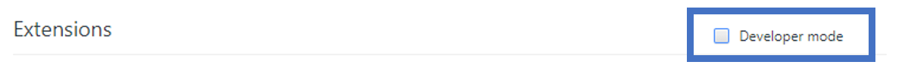
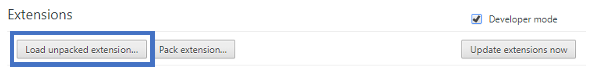
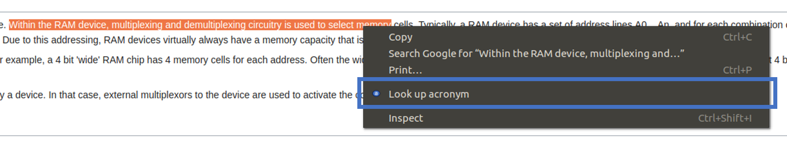
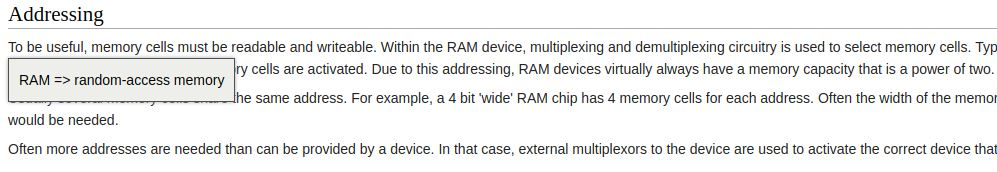
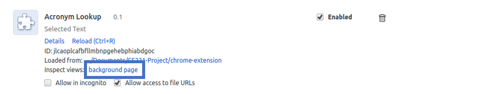

# Using the Chrome Extension
To be able to look up acronyms as you come across them online, you can try out our chrome extension! To host it yourself, follow these steps (after cloning the repo and setting up your environment):

## 0. Set up your environment
See the [main README.md file](../README.md) for instructions on how to set up your `virtualenv` and train or download the model.

## 1. Load the chrome extension
Download chrome (if you don't already have it), and navigate to `chrome://extensions`. Check the box to enable developer mode:  
  
Click the button to "load unpacked extension".  

## 2. Run the web app
To be able to process requests from the chrome extension, you'll need a simple web application running locally. To do this, we run a WSGI server using `gunicorn`. To use it, simply run `gunicorn app:app` in the main folder of the project. Note that this will look for the `app.py` file in the main project folder. There is a symbolic link to `app.py`. This should create a server at `127.0.0.1:8000`. If for some reason you want to use a different port, you'll need to modify the POST call in `lookUpAcronym.js`.

## 3. Try out the chrome extension!
Now simply use chrome to navigate to any HTML page. Select an arbitrary amount of text that contains one or more acronyms, then right click. You should see the following option in your context menu:  
  
Click on the option labelled "look up acronym." This will query the server you set up in step 2. You should see the result returned as a popup in the browser:  
  
We didn't fiddle much with the exact placement of the popup, so it may be off to one side by a little bit. Once you click away the popup will disappear. The popup will show you the program's best guess for what the acronym means (purely based on the text it was given). Enjoy!

# Tips, Tricks and Caveats
It's worth mentioning that occasionally the chrome extension will be wrong. This is simply because the program was created as a proof of concept, and was therefore only trained on about 1000 Wikipedia articles. Thus we make no guarantees, but instead invite you to help us improve it! If you make any changes, please consider upstreaming them. To help you with development, below are a few "gotchas" of working with Chrome extensions. For specific ideas for future work, and more information on retraining the model etc. see [this page](../future-work/README.md).

### Viewing Print Statements
Use `console.log` prints within the code of the Chrome extension to debug as you go. However, note that to view these print statements, you'll need to open up the Chrome developer console (right-click, then click "Inspect" and click the "Console" tab). However, note that anything printed by `lookUpAcronym.js` will appear in the Chrome developer console for the **background page**, because it is a "background" script. To access this page, click the "background page" link on the Chrome extensions page:  
  
Statements printed in `showMeaning.js` will appear in the developer console for whichever tab you clicked the "look up acronym" button from.

### Reloading Code
Every time you make a change to the code, be sure to a) save the code, b) reload the chrome extensions tab and c) reload the page that you are testing on. It sounds simple, but it still "got" me occasionally. Also, note that if you make any changes to `app.py`, you'll need to restart the web server.
